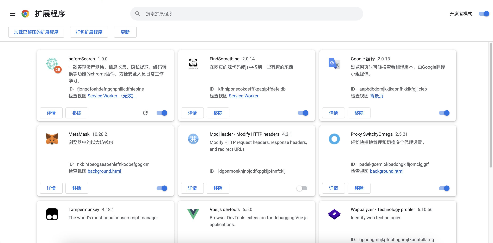
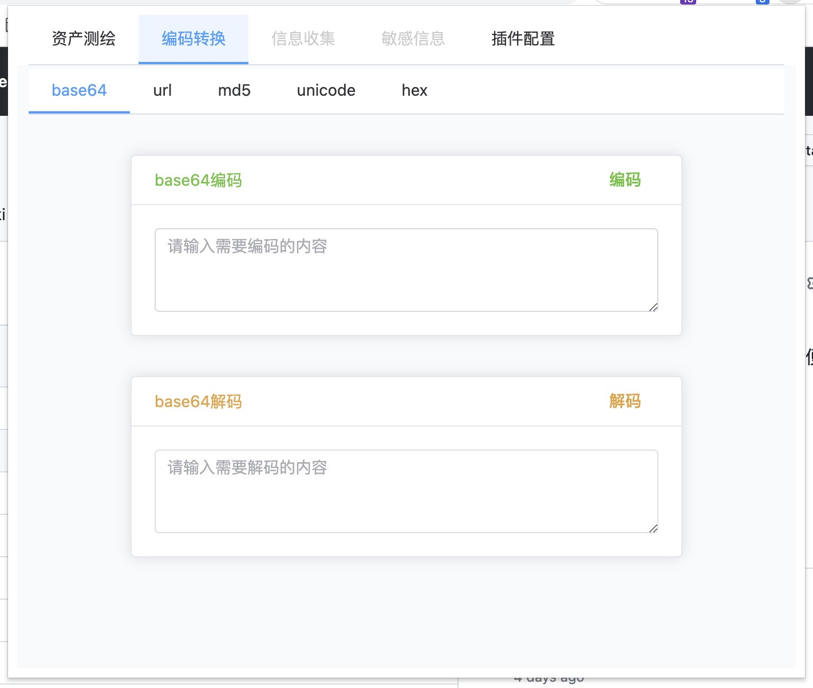
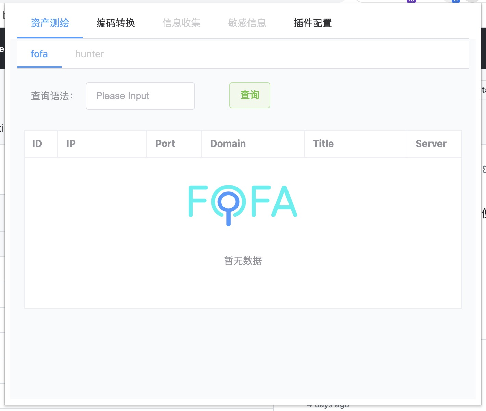
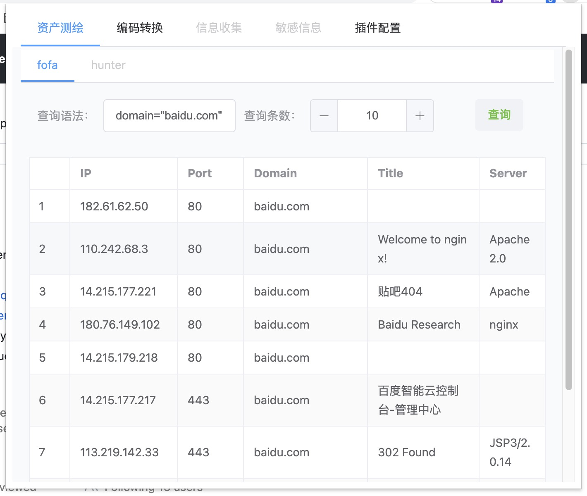
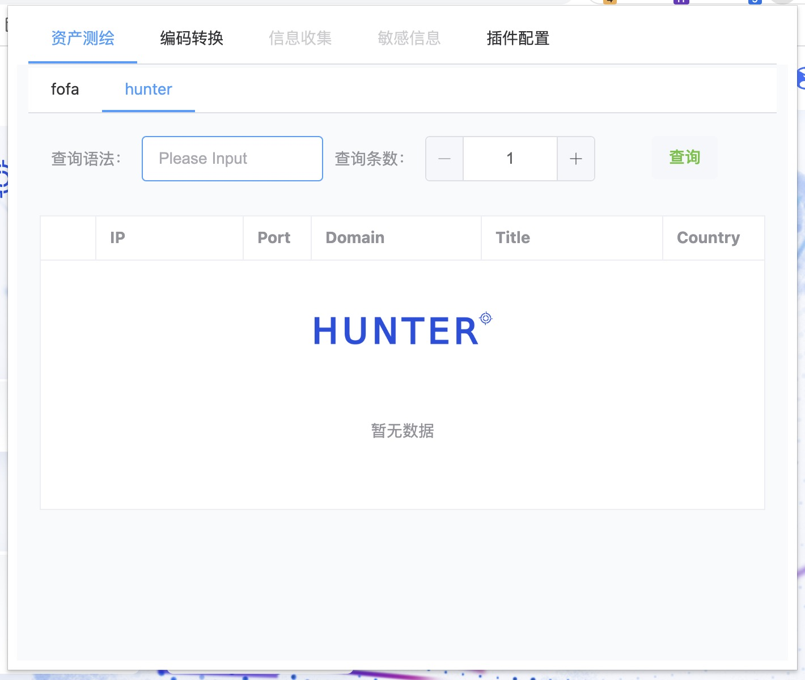
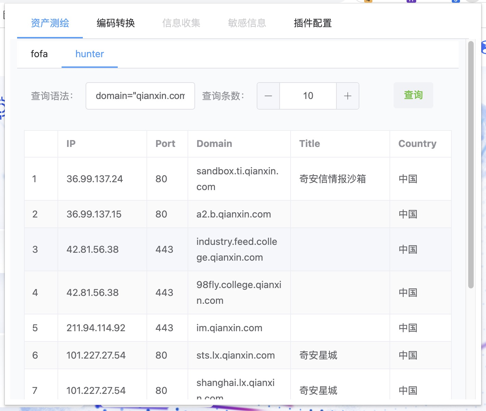

# beforeSearch

## 简介

插件为manifest v3版本开发，使用了vue3+element-plus

最终预期实现功能包括多种编码转换，资产测绘，指纹识别，前端敏感信息发现，信息搜集，等等，后续可能会增加更多功能。

## 使用方式

下载release新版本，将解压后的dist文件夹拖入到谷歌浏览器插件页面即可

后期功能丰富后打算尝试上线谷歌商店。

## 更新及功能

### 2023.4.6

实现编码转换功能，包括base64编码解码，url编码解码，md5加密，unicode编码解码，hex编码解码。

### 2023.4.10

增加fofa查询功能，配置email和apikey后调用fofa官方api进行查询资产

### 2023.4.11

完成fofa查询，可根据语句进行查询

### 2023.4.13

完成hunter查询，配置apikey后可调用官方api查询

